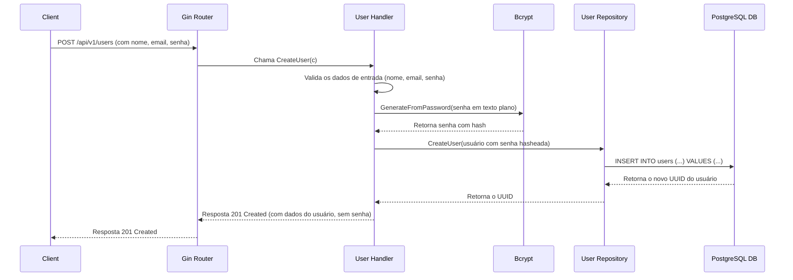
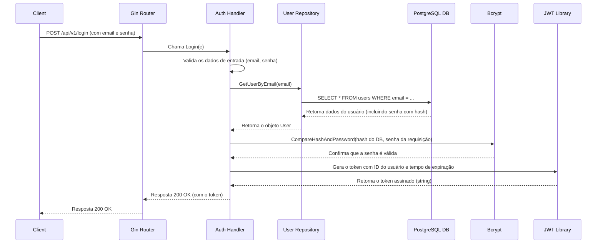
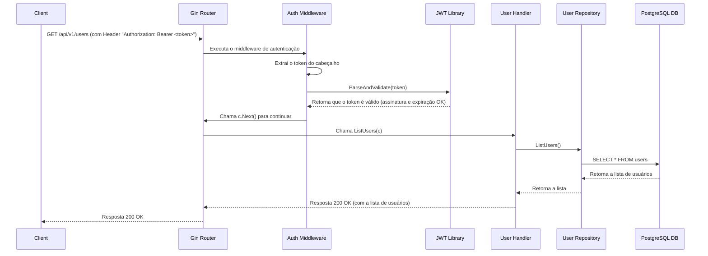

# API REST com Go, Gin e PostgreSQL

Uma API RESTful simples e robusta construída com Go, o framework Gin e PostgreSQL. Este projeto é totalmente containerizado usando Docker e Docker Compose, proporcionando um ambiente de desenvolvimento limpo e reproduzível.

## ✨ Funcionalidades

- **Autenticação JWT:** Endpoints seguros com JSON Web Tokens.
- **Gestão de Usuários:** Funcionalidade CRUD (Criar, Ler, Atualizar, Deletar) completa para usuários, com senhas criptografadas.
- **Health Check:** Um endpoint `/health` para monitorar o status da API.
- **Containerização:** Roda inteiramente em containers Docker para consistência e facilidade de implantação.
- **Estrutura Organizada:** Segue o layout de projeto padrão do Go para uma melhor organização.

## 🛠️ Tecnologias Utilizadas

- **Go:** Linguagem de programação principal.
- **Gin:** Framework web HTTP de alta performance para Go.
- **PostgreSQL:** Sistema de banco de dados objeto-relacional de código aberto.
- **sqlx:** Biblioteca que estende o pacote `database/sql` padrão.
- **golang-jwt:** Para geração e validação de tokens JWT.
- **bcrypt:** Para hashing seguro de senhas.
- **Docker & Docker Compose:** Para containerizar e orquestrar os serviços da aplicação e do banco de dados.

## 🚀 Começando

Siga estas instruções para obter uma cópia do projeto e executá-lo em sua máquina local para fins de desenvolvimento e teste.

### Pré-requisitos

- [Go](https://go.dev/doc/install) (v1.24 ou mais recente)
- [Docker](https://docs.docker.com/get-docker/) e [Docker Compose](https://docs.docker.com/compose/install/)

### Instalação e Execução

1.  **Clone o repositório:**
    ```sh
    git clone git@github.com:raingrave/go-rest-api.git
    cd go-rest-api
    ```

2.  **Crie o arquivo de ambiente:**
    Copie o arquivo de exemplo `.env.example` para um novo arquivo chamado `.env`. O arquivo `.env` é onde suas variáveis de ambiente locais serão armazenadas e ele não é enviado para o Git.
    ```sh
    cp .env.example .env
    ```
    *Você pode ajustar os valores no arquivo `.env` se necessário (por exemplo, para usar uma chave JWT diferente).*

3.  **Execute a aplicação com Docker Compose:**
    Este comando irá ler as variáveis do seu arquivo `.env`, construir a imagem da API, iniciar os containers e conectá-los.
    ```sh
    docker compose up --build -d
    ```
    A API estará disponível em `http://localhost:3000`.

4.  **Configure o banco de dados:**
    Conecte-se ao banco de dados PostgreSQL (rodando em `localhost:5432`) e execute o seguinte comando SQL para criar a tabela `users`.
    ```sql
    CREATE TABLE users (
        id UUID PRIMARY KEY DEFAULT gen_random_uuid(),
        name TEXT NOT NULL,
        email TEXT NOT NULL UNIQUE,
        password TEXT NOT NULL,
        created_at TIMESTAMP WITH TIME ZONE DEFAULT NOW()
    );
    ```

## Endpoints da API

A URL base é `http://localhost:3000/api/v1`.

| Método   | Endpoint      | Descrição                               | Autenticação | Corpo da Requisição (Exemplo)                     |
| :------- | :------------ | :-------------------------------------- | :----------- | :------------------------------------------------ |
| `GET`    | `/health`     | Verifica o status da API (fora da versão).| Nenhuma      | `N/A`                                             |
| `POST`   | `/users`      | Cria um novo usuário. Validações: `name` (obrigatório), `email` (obrigatório, formato de email), `password` (obrigatório, min 8 caracteres). | Nenhuma      | `{"name":"...", "email":"...", "password":"..."}` |
| `POST`   | `/login`      | Autentica um usuário e retorna um token. | Nenhuma      | `{"email":"...", "password":"..."}`               |
| `GET`    | `/users`      | Lista todos os usuários.                | **Bearer Token** | `N/A`                                             |
| `GET`    | `/users/{id}` | Busca um único usuário pelo ID.         | **Bearer Token** | `N/A`                                             |
| `PUT`    | `/users/{id}` | Atualiza um usuário existente.          | **Bearer Token** | `{"name":"...", "email":"..."}`                   |
| `DELETE` | `/users/{id}` | Deleta um usuário pelo ID.              | **Bearer Token** | `N/A`                                             |

### Como se Autenticar

1.  Crie um usuário via `POST /users`.
2.  Faça login com as credenciais via `POST /login` para receber um token. O tempo de expiração padrão do token é de 60 minutos, mas pode ser configurado através da variável de ambiente `JWT_EXPIRATION_MINUTES`.
3.  Para acessar os endpoints protegidos, inclua o cabeçalho `Authorization` em suas requisições:
    ```
    Authorization: Bearer <seu_token_jwt_aqui>
    ```

### Erros de Validação

Ao criar ou atualizar recursos, se houver um erro de validação nos dados enviados, a API retornará uma resposta `400 Bad Request` com um corpo JSON detalhando os campos problemáticos.

**Exemplo de Resposta de Erro:**
```json
{
    "errors": {
        "Email": "Invalid email format",
        "Password": "This field must be at least 8 characters long"
    }
}
```

## 🏛️ Arquitetura e Fluxo de Dados

Os diagramas de sequência abaixo ilustram os principais fluxos da aplicação.

### 1. Criação de Usuário



### 2. Autenticação (Login)



### 3. Acesso a Recurso Protegido


